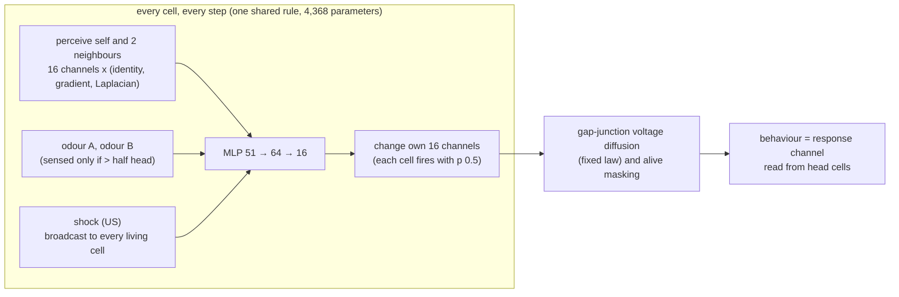

# Prometheus-α

**Does a regenerating body remember what its lost head learned? Synthetic worms grow from one cell, learn which odour predicts a shock, lose their heads, regrow them, and are asked again.**

Author/project lead: **Kai Piper** · Version **0.7.0** · 30 September 2026 · **Paper: [paper/Prometheus_alpha_paper.md](paper/Prometheus_alpha_paper.md)**

> **Scientific status.** Everything here is a synthetic computational experiment on a neural cellular automaton. "Memory", "head", "odour" and "shock" name parts of a simulation. Nothing here is a model of a particular animal, and nothing here bears on any person or clinical condition.

Every day an eagle ate Prometheus's liver and every night it grew back. The name means *forethought*. This laboratory asks a question about regrowth and foresight that biology has raised and never answered: when an animal regrows the organ that learned something, does the new organ know it?

Planarian flatworms trained to find food in a textured, lit dish still show the habit after their heads are cut off and regrown ([Shomrat & Levin 2013](https://doi.org/10.1242/jeb.087809)); an August 2026 preprint reports the same with light-to-food conditioning ([bioRxiv 2026.08.10.741213](https://www.biorxiv.org/content/10.64898/2026.08.10.741213v1)). Moths remember what they learned as caterpillars through the dissolution of metamorphosis ([Blackiston, Silva Casey & Weiss 2008](https://doi.org/10.1371/journal.pone.0001736)). Where the memory waits while the brain is gone, and how the new brain reads it back, is unknown. McConnell's memory-transfer experiments of the 1960s asked the same question and could not be replicated.

Prometheus-α asks it of a synthetic body in which every cell's state can be read, copied, swapped and transplanted:

1. **A body that learns without changing its rule.** One small network, shared by every cell, is trained by backpropagation through whole lives. Within a life the rule is frozen, so a worm can only learn by changing its cells' *state*. That makes "where is the memory?" a question about places in the body.
2. **Only the head can smell.** A cell senses the odours only when it is more than half head tissue. Behaviour is read from the head. After complete decapitation no surviving cell can smell or behave.
3. **Pavlovian conditioning with the proper control.** One odour is paired with a shock. Every paired worm has an *explicitly unpaired twin*: the same odours, the same number of shocks at the same moments of its life, the same random update noise, the same founder; only the contingency differs. The memory measure is taken within the worm, so baseline shifts cancel.
4. **Emergent versus selected.** *E* rules are trained to learn and to regenerate, but never asked to remember through a regeneration. *S* rules are selected from their E sibling by also asking for memory after one amputation. Chimeras, voltage transplants, trunk fragments and repeated amputation are never trained in either.

### New in v0.7: the trade-off that wasn't

v0.6 left a post-hoc correlation: memories that shrug off noise seemed to die with their cells. v0.7 tested it causally. Each selected rule got three siblings, trained on identical lives with one extra stress: cell turnover (**T**), noise in the cells' hidden state (**N**), or nothing (**C**, the control for extra training). All were then measured on the same worms with held-out stresses. [Preregistered](prereg/PREREGISTRATION_v7.json) and hash-locked before any measurement; **all eight predictions held.**

* **Both trainings work.** Noise training raises noise memory by +0.79 and +0.42. Turnover training raises turnover memory by +0.56 in lineage 1; lineage 0 was already at 0.94 and had no room.
* **No trade-off.** Hardening against one stress never cost the other. It helped instead. Noise-trained N1 survives cell turnover at 0.92 (control 0.41), nearly as well as T1 (0.97), without ever seeing a cell die. The v0.6 correlation was lineage, not constraint.
* **How (exploratory).** Noise training makes the stored code *louder, not wider*: the distance between A- and B-trained twins' hidden states roughly doubles or triples, while the number of cells carrying it stays the same. Across eight rules, code size tracks noise tolerance (ρ = 0.83, post hoc). Turnover training leaves the stored pattern unchanged, so what it changed is how the tissue rebuilds the pattern after cells die.
* **Try it.** The browser lab has new *Cell turnover* and *Noise the head* buttons and all fourteen rules.

Across seven preregistered rounds, **116 of 135 stated predictions held**.

### New in v0.6: memory across generations, and a mechanism that failed

* **Memory passes down generations.** Split a fission-rule worm, let the back half regrow, and split that worm again, three times. Only one split was ever trained. The memory reaches the third generation, fading as it goes: F0 0.95 → 0.77 → 0.25, F1 0.97 → 0.49 → 0.47.
* **My mechanism for robustness failed.** I predicted that a wider attractor basin would make a memory survive cell turnover. The correlation came out negative (ρ = -0.43).
* **A possible trade-off (post hoc, not a finding).** Measured where turnover acts, in the heads of intact worms, the correlation is strongly negative (ρ = -0.83). Memories that shrug off noise die with their cells, and memories that survive cell death are easily scrambled. This is the next hypothesis to test.

### New in v0.5: turnover, time and eight-cell animals

Four challenges no rule was ever trained for, run on all eight rules:

* **Eight cells regrow a remembering worm.** Keep only the neck and anterior trunk (8 of 32 cells). Every selected, balanced and fission rule regrows a whole worm that remembers (0.96–1.00). Neither emergent rule does.
* **Only a distributed copy survives in the tail.** From 8 tail cells, only F1 regrows a remembering worm (+0.25). F0 inverts the memory again (−0.14).
* **Ship of Theseus.** The memory survives 200 steps in which 10% of cells die at random every 20 steps. This holds in 7 of 8 rules, and robustness follows lineage: the S0 line (0.89, 0.96, 0.57) is much sturdier than the S1 line (0.19, 0.45, 0.32).
* **Time.** Without reminders the memory lasts 300 steps, twenty times the longest trained delay, in 7 of 8 rules. E1 forgets.

### New in v0.4: selection can spread the copy, one cell can hold a memory, and every rule has a private code

* **Fission rules.** In v0.3 only the front half of a split worm remembered. F rules, selected from their S siblings on split worms, regrow a whole worm from the back half, and that worm remembers (+0.97, +0.99). The two F rules found different solutions:
  * **F1** built a genuinely distributed copy. The trunk and tail of an intact worm carry a usable copy (+0.39 vs ~0 in S1), and a held-out split further back partly works (+0.21).
  * **F0** solved the trained cut only. Its trunk state, transplanted, writes the *opposite* odour (−0.32), and the held-out split fails.
* **One cell is enough.** A pattern designed for a single cell writes a full memory into untrained headless bodies (S0 +0.99, S1 +0.97, F1 +0.99).
* **Private codes.** One selected rule's compiled memory, written into the other's body, writes the *opposite* odour (−0.57, −0.36). The two rules' codes are weakly anti-aligned and their decoders unrelated. Each rule invented its own engram code, as Morpheus's tissues invented opposite voltage codes.

### New in v0.3: memory surgery, four-cell memories, and information the body never uses

* **Memory surgery.** Write the compiled pattern for the *other* odour into a trained worm's headless body, and the regrown head switches memory. This happened in 99.6% (S0) and 100% (S1) of worms.
* **Four cells are enough.** A compiled memory confined to the four wound-edge cells writes a full memory into an untrained body (R(A) − R(B) about ±0.98).
* **Decodable is not used.** A linear decoder reads the odour from the wound-edge cells with 100% accuracy in selected rules. It also reads it in the emergent rules (97%, 91%), whose regrown heads keep none of the memory. The body holds the information right next to the wound, and the new head ignores it. We predicted the opposite.
* **Balanced selection.** B rules, selected to remember through two amputations, rescue the odour their S sibling forgets. At cycle 4, B1 keeps 0.84 where S1 keeps 0.33. B0 holds both odours at about 1.0 through eight decapitations.
* **Fission.** Cut a trained worm in half. The front half, which keeps the head, remembers in every rule; the back half, which must grow a new head, remembers in none. The copy exists only at the neck of a decapitated worm.

### New in v0.2: extinction, reversal, a memory compiler, and where the copy lives

* **The engram is at the wound edge.** Implanting the trained body's hidden channels at only the four sites next to the wound transfers 99% and 98% of the memory. The rest of the trunk transfers 0.1%.
* **A memory compiler.** A 10 × 40 hidden-state pattern, designed by gradient descent through regeneration on 32 worms, makes 128 held-out untrained worms regrow heads that remember an odour they never experienced (+1.00, +0.99). The same values at shuffled sites write 0.14 and −0.01. It even works, one odour at a time, in emergent rules whose bodies never keep a copy.
* **The body is conservative.** After learning one odour and then the other, intact heads half-adopt the new lesson. Regrown heads revert toward the first (0.52 → 0.82 and 0.34 → 0.63). The pilot predicted the opposite.
* **Attractor, half replicated.** The v0.1 post-hoc finding, retested with its direction named in advance, holds in S1 (0.96 vs 0.34 at cycle 4) and falls below threshold in S0.
* **Extinction.** Only S1 extinguishes (−45%). The pilot's inversion after regrowth did not replicate.

### What v0.1 found (four rules, 128 worms per test, preregistered)

* **Without selection, the new head forgets.** The emergent rules learn (M = 0.80 and 0.73, where a full conditioned response is about 1). After complete decapitation they regrow near-perfect heads, and those heads carry none of the memory: M = 0.001 and −0.005, with both 95% intervals inside ±0.01. In chimeras the head's memory wins outright. A body that can rebuild a head does not, by default, keep a copy of what that head knew.
* **Selection makes the memory outlive its organ, and the ability generalises.** S rules were selected only to remember through one amputation, and some of those training cuts spared a few head cells. They keep the memory through complete decapitation (retention 0.98 and 1.02). They also keep it through removal of both head and tail (0.96, 0.96) and through a third successive decapitation (0.94, 0.73). Neither of those was ever trained.
* **The body's copy is not electrical.** Voltage is the channel gap junctions couple, and the one the bioelectric literature points to. It is neither necessary (swapping it for an untrained twin's voltage keeps 98–99% of the memory) nor sufficient (implanting it transfers 2–4%). The ten hidden channels, written alone into an untrained twin's headless body, transfer 1.00 and 0.98 of the memory. The twin's new head then remembers what it never learned.
* **A trained body teaches a naive head.** A naive head grafted onto a trained body takes on about half of the body's memory (0.51, 0.47) with no amputation at all.
* **What we got wrong, and what that revealed.** From the S102 pilot we predicted two things. First, that head and body would split an intact chimera's memory evenly: in fact the head leads (dominance 0.84, 0.53). Second, that a decapitated chimera would regrow the body's memory: this held only weakly in one rule (−0.12) and reversed in the other (+0.36), against the pilot's −0.66. Reading the grafts afterwards showed why. This part is post hoc, not preregistered. Selection made each rule's memory of one odour an **attractor** and its memory of the other **metastable**. Conflicts resolve toward the favoured odour whichever tissue carries it. Transfer passes on the favoured odour and hardly the other. Across repeated decapitations the favoured memory holds (S1: 0.96 after cycle 1, 0.96 after cycle 4) while the other erodes (0.97 to 0.32). The two S rules favour different odours: S0 favours B, S1 favours A. The E rules show no such bias.
* **Restraint.** Ten of the 40 confirmatory tests passed Holm with effects below 0.04, and none of them is claimed. Across 160 A/A tests the false-positive rate was 5 in 160.

Predictions made in the locked preregistration, against the outcomes:

| | hypothesis | predicted E / S | E0 | E1 | S0 | S1 |
|---|---|---|---|---|---|---|
| H1 | learns, intact | yes / yes | yes (+0.80) | yes (+0.73) | yes (+0.99) | yes (+0.93) |
| H2 | remembers after complete decapitation | no / yes | no (+0.00) | no (-0.00) | yes (+0.97) | yes (+0.95) |
| H3a | voltage is necessary | – / no | no (+0.00) | no (-0.00) | no (+0.02) | no (+0.01) |
| H3b | voltage is sufficient | – / no | no (+0.00) | no (-0.00) | no (+0.04) | no (+0.02) |
| H3c | hidden channels are sufficient | – / yes | no (+0.00) | no (-0.00) | yes (+0.99) | yes (+0.93) |
| H4 | intact chimera is not an even split | yes / no | yes (+0.99) | yes (+0.99) | yes (+0.84) ✗ | yes (+0.53) ✗ |
| H4b | decapitated chimera regrows the body's memory | no / yes | no (+0.00) | no (-0.01) | no (+0.36) ✗ | yes (-0.12) |
| H5 | a naive head takes the body's memory | no / yes | no (+0.00) | no (+0.00) | yes (+0.51) | yes (+0.47) |
| H6 | third Promethean cycle | no / yes | no (+0.00) | no (+0.00) | yes (+0.94) | yes (+0.73) |
| H7 | trunk fragment | no / yes | no (+0.00) | no (-0.00) | yes (+0.96) | yes (+0.96) |

31 of 34 preregistered predictions held (✗ marks a miss; – means no prediction was stated). The number in brackets is the tested mean. "yes" requires Holm-corrected significance and an effect of at least 0.10.

Every number in the results table is checked in CI against the results file it comes from (`prometheus claims check`). The hypotheses, sample sizes, seeds and decision rules were hash-locked before each round's confirmatory experiments ([v0.1](prereg/PREREGISTRATION.json), [v0.2](prereg/PREREGISTRATION_v2.json), [v0.3](prereg/PREREGISTRATION_v3.json), [v0.4](prereg/PREREGISTRATION_v4.json), [v0.5](prereg/PREREGISTRATION_v5.json), [v0.6](prereg/PREREGISTRATION_v6.json), [v0.7](prereg/PREREGISTRATION_v7.json); CI verifies all seven locks); pilots and pre-lock design changes are disclosed there and in [`docs/DEVIATIONS.md`](docs/DEVIATIONS.md).

## Built from eight earlier projects

| Earlier project | What Prometheus-α takes from it |
|---|---|
| [Morpheus](https://github.com/kai9987kai/morpheus) | the regenerating neural cellular automaton with a fixed gap-junction voltage law; "does a rewritten state survive re-amputation?" (Morpheus's compiled heads did not); the claims-ledger checker, statistics and JS/Python parity testing. Morpheus asked whether a *body plan* is remembered; this asks whether a *learned association* is |
| [Ghost in the Machine](https://github.com/kai9987kai/GhostInTheMachine) | the yoked-twin design (master vs a twin with matched input statistics), transplanting a signal between individuals to test where an effect lives, preregistration with a hash lock, A/A calibration, and a smallest effect of interest so a precise but trivial effect cannot pass |
| [GenesisEngine](https://github.com/kai9987kai/GenesisEngine) | development from a single founder cell; a deterministic seeded core separate from the renderer; paired seeds per intervention |
| [Supermix Expanse](https://github.com/kai9987kai/Supermix-expanse) / [v2](https://github.com/kai9987kai/Supermix-Expanse-v2) | the "evoked" lesson: the CNS core's gain was mostly a constant bias, so the readout here is a within-worm difference (CS+ minus CS-) that a bias cannot fake; zero-initialised action heads; hash-locked hypotheses with verdicts computed from recorded metrics |
| [Supermix Archimedes](https://github.com/kai9987kai/supermix-archimedes) | grafting between independently trained systems, made literal: chimeras are grafts of one worm's head onto another's body, and the question is which system's knowledge wins |
| [Supermix](https://github.com/kai9987kai/Supermix) | "the ruler moved": test generators, caps and cohorts are fixed and seeded, and every results file records the weights' and the preregistration's SHA-256 and the git commit |
| [FLY-DIAMOND-NEXUS](https://github.com/kai9987kai/FLY-DIAMOND-NEXUS) | a broadcast unconditioned signal to every cell, like dopamine to the mushroom body; paired-seed arms with bootstrap intervals; exact, seed-reproducible replay in the browser |

## What is new here

To my knowledge none of these has been done before:

* **A computational Shomrat–Levin experiment.** A learned association formed only by head tissue, followed by complete decapitation and regeneration, in a body whose every cell state is observable.
* **Emergent versus selected memory persistence.** The same rule, before and after selection for remembering through one regeneration, tested on held-out manipulations it never saw.
* **Memory chimeras.** The head of a worm that learned A grafted onto the body of a worm that learned B: whose memory does the animal express, and whose comes back after the chimera's head is cut off?
* **Memory transplant by state.** Copying one channel group of a trained, decapitated body (its voltage, or its hidden channels) and nothing else into an untrained twin's body, then asking the twin's regrown head.
* **Promethean cycles.** Repeated decapitation of the same worm, far beyond anything trained.
* **A memory compiler and memory surgery.** Gradient descent through regeneration designs a hidden-state pattern that installs a chosen memory, or overwrites an existing one, in the regrown head.
* **Locating an engram to four cells, and separating decodable from used.** Causal implants and a linear decoder disagree in emergent rules, which is the point.
* **Fission of a trained synthetic animal.** Which half remembers.

## How it works



**The worm.** 40 sites; the body occupies 32 of them (head 8, trunk 16, tail 8). Each cell has 16 channels: alive-ness, membrane voltage, three region identities, a response channel and 10 hidden channels with no target. A worm grows for 32 steps from one founder cell.

**A life in an experiment.** Grow 32 steps; conditioning, 48 steps (six 8-step slots in random order: two with the CS+, two with the CS-, two empty; the paired worm is shocked in the last 3 steps of each CS+, its unpaired twin in the middle of each empty slot); wait 12 steps; then the experiment's manipulation (decapitation, a graft, a voltage transplant); regenerate 32 steps; test each odour alone for 6 steps. The memory measure is `M = [R(CS+) - R(CS-)] of the worm - the same of its unpaired twin`.

**Training.** Exact backpropagation through lives of about 180 steps (PyTorch, CPU), batches of 32 random lives (paired, unpaired or naive; with or without a first wound; with or without a wound after conditioning). The loss scores anatomy at four checkpoints, the unconditioned response to the shock, a silent baseline, and the memory test. E rules score memory only when the body was not wounded after conditioning; S rules also score it after a head or tail cut.

## Results

<!-- claims:start (generated by `prometheus claims render`; edit claims/claims.json) -->

| claim | status | evidence |
|---|---|---|
| **Selected rules remember through complete decapitation: the regrown head, built from cells that never smelled the odours, knows which one predicted the shock** | **replicated** | memory M in the regrown head (paired minus unpaired twin, 128 worms): S0 0.97 (retention 0.98 of the intact memory, d_z 8.40, Holm p 0.001); S1 0.95 (retention 1.02, d_z 8.14, Holm p 0.001). Positive control: S rules were selected for one regeneration |
| **Emergent rules also remember through decapitation** | **not supported** | as predicted, no: E rules regrow near-perfect heads (IoU E0 0.995, E1 0.999) that carry none of an intact memory of 0.81 / 0.74: M after regeneration E0 0.001 [95% CI -0.000, 0.001], E1 -0.005 [-0.006, -0.004], both intervals far inside the smallest effect of interest (0.10) |
| **The memory in the body is carried by its hidden (non-electrical) channels: writing only those into an untrained twin's headless body makes the twin's new head remember** | **replicated** | M in the implanted twin's regrown head: S0 0.99 (1.00 of the donor's own), Holm p 0.001; S1 0.93 (0.98), Holm p 0.001. Predicted from pilot S102 (0.85) |
| **v0.2: the body's copy lives in the four cells at the wound edge** | **replicated** | hidden channels implanted into the untrained twin at sites 12-15 only transfer S0 0.99 / S1 0.98 of the donor's memory; at sites 16-27, 0.001 / 0.001 |
| **v0.2: a memory compiler. A gradient-designed hidden pattern written into untrained headless bodies makes held-out regrown heads remember an odour they never experienced** | **replicated** | written memory vs the same values at shuffled sites: S0 1.00 vs 0.14, S1 0.99 vs -0.01; also in emergent rules, whose bodies never keep a copy: E0 0.51 vs 0.01, E1 0.66 vs -0.01 (one odour only in each E rule) |
| **v0.4: one cell can hold a whole memory. A pattern designed for site 14 alone writes a memory into untrained headless bodies** | **replicated** | written memory (R(A) - R(B)) / 2 on 128 held-out worms: S0 0.99, S1 0.97; E0 0.04, E1 0.44 |
| **v0.4: fission rules. Selection on split worms makes the back half, which must grow a new head, remember** | **replicated** | posterior half after a split at site 20 (trained) / 24 (held out): F0 0.97 / -0.09; F1 0.99 / 0.21; S siblings at 20: S0 0.004, S1 -0.005. After complete decapitation: F0 0.97, F1 0.98 |
| v0.4: a distributed copy. In intact fission-selected worms the trunk and tail (sites 16-35) carry a copy that a decapitated twin's new head can use, more than in the S sibling | **mixed** | memory transferred by sites 16-35 of intact trained worms: F0 -0.32 vs its S sibling 0.00; F1 0.39 vs its S sibling 0.00 |
| **v0.4: a universal memory code. One selected rule's compiled memory, written into the other rule's body, writes the intended odour** | **not supported** | as predicted, no, and worse than no: S1's code in S0 bodies writes the opposite odour (-0.57), S0's in S1 bodies -0.36. Exploratory: the two rules' memory directions at the wound edge correlate -0.39, their decoders -0.07. Each rule invented its own code |
| **v0.5: eight cells regrow a remembering worm. Keep only the neck and anterior trunk (sites 12-19) and the whole new worm remembers** | **replicated** | M after 64 steps of regrowth from 8 cells: S0 0.99, S1 0.99, B0 0.96, B1 1.00, F0 0.99, F1 0.99; emergent rules E0 -0.00, E1 -0.01 |
| **v0.5: Ship of Theseus. The memory survives 200 steps of random cell death and replacement (10% of cells every 20 steps)** | **supported in 7 of 8 rules** | M after turnover: S0 0.89, B0 0.96, F0 0.57 (the S0 lineage) vs S1 0.19, B1 0.45, F1 0.32 (the S1 lineage); E0 0.36, E1 0.06 (not supported). Robustness follows lineage more than selection regime |
| v0.5: from an 8-cell tail fragment (sites 24-31) only the rule with a distributed copy regrows a remembering worm | **descriptive** | as predicted: F1 0.25; F0 -0.14 (inverted again); S0 0.01, S1 -0.00, B0 -0.00, B1 -0.00, E0 -0.00, E1 0.00 |
| v0.5: the memory lasts 300 steps without any reminder (training delays were 4-16) | **supported in 7 of 8 rules** | M: E0 0.92, E1 -0.01 (forgets), S0 0.96, S1 0.80, B0 0.99, B1 1.00, F0 0.88, F1 0.87 |
| **v0.6: memory passes down three generations of fission (only one split was ever trained), fading each time** | **replicated** | M after generations 1, 2, 3: F0 0.95, 0.77, 0.25; F1 0.97, 0.49, 0.47; S0 0.00, 0.00, 0.00 and S1 -0.00, -0.00, -0.01 never pass it on |
| v0.6: a wider attractor basin at the neck predicts survival of cell turnover | **not supported** | Spearman rho -0.43 (one-sided exact p 0.822, 6 rules). Critical noise sigma*: S0 1.00, S1 1.50, B0 1.00, B1 1.50, F0 3.00, F1 1.00 |
| Post hoc: a trade-off. Rules whose head memory tolerates noise are the ones whose memory dies with cell turnover | **post hoc** | Spearman rho between head-basin area and v0.5 turnover memory, 6 rules: -0.83. Basin area: S0 1.16, B0 1.13, F0 1.33 (turnover-robust) vs S1 2.26, B1 2.55, F1 1.59. Not preregistered. Tested causally in v0.7 (v7-H33, v7-H34): not a trade-off |
| **v0.7 trade-off: hardening the memory against cell loss costs noise tolerance** | **not supported** | as predicted, no, and the difference points the other way: noise memory of the control C vs the turnover-trained T, lineage 0 0.13 vs 0.27 (C - T -0.13, Holm p 1.000); lineage 1 0.51 vs 0.56 (-0.05, Holm p 1.000). Hardening against cell loss did not cost noise tolerance; if anything it bought some |
| **v0.7 trade-off: hardening the memory against noise costs survival of cell loss** | **not supported** | as predicted, no, and the difference points the other way: turnover memory of the control C vs the noise-trained N, lineage 0 0.94 vs 0.99 (C - N -0.04, Holm p 1.000); lineage 1 0.41 vs 0.92 (-0.51, Holm p 1.000). Noise training made lineage 1's memory survive cell loss almost as well as turnover training did (T1 0.97); the v0.6 correlation was lineage, not a trade-off |
| v0.7: training under cell turnover hardens the memory against it | **mixed** | memory after 200 steps of turnover, turnover-trained T vs control-trained C sibling: lineage 0 0.99 vs 0.94 (difference 0.04, Holm p 0.028: significant but below the smallest effect of interest; lineage 0 was already near ceiling, as predicted); lineage 1 0.97 vs 0.41 (0.56, Holm p 4.0e-04) |
| v0.7: training under hidden-state noise hardens the memory against it | **replicated** | memory after sigma 1.5 noise on the head's hidden channels, noise-trained N vs control C: lineage 0 0.92 vs 0.13 (difference 0.79, Holm p 4.0e-04); lineage 1 0.93 vs 0.51 (0.42, Holm p 4.0e-04) |
| Exploratory: noise training makes the engram louder, not wider; turnover training barely changes it | **exploratory** | distance between the hidden states of identical twins trained on A and on B, mean over living sites (amplitude) and participation ratio (spread, cells): C0 0.86 / 13.0, T0 0.80 / 11.4, N0 1.94 / 11.2; C1 1.07 / 10.7, T1 1.06 / 10.9, N1 3.13 / 11.9. So T1's new resistance to cell loss is not visible in the stored pattern. Post hoc, over the eight S, C, T, N rules, amplitude tracks noise memory (Spearman rho 0.83, one-sided exact p 0.008). The lineages differ in shape: lineage 0 codes are flat across the head (coefficient of variation S0 0.09, B0 0.06, F0 0.15), lineage 1 codes graded (S1 0.27, B1 0.26, F1 0.32) |
| **v0.3: memory surgery. Writing the compiled pattern for the other odour into a trained worm's headless body overwrites its real memory** | **replicated** | R(A) - R(B) of the regrown head: A-trained worms given pattern B S0 -0.89, S1 -0.88; B-trained given pattern A S0 0.96, S1 0.76; fraction of worms whose memory switched 0.996, 1.000 |
| v0.3: four cells are enough. A compiled memory confined to the wound-edge sites 12-15 writes a full memory | **replicated** | R(A) - R(B) of held-out regrown heads with the sparse A / B pattern: S0 0.98 / -0.99, S1 0.98 / -0.99; emergent rules E0 0.04 / -0.04, E1 0.74 / -0.20 |
| **v0.3: decodable is not used. A linear decoder reads the odour from the wound-edge cells, in emergent rules too, whose regrown heads never use it** | **replicated** | held-out decoding accuracy, edge vs rest of trunk: S0 1.00 vs 0.69, S1 1.00 vs 0.48; E0 0.97 vs 0.52, E1 0.91 vs 0.52 (predicted: no in E rules, which keep 0% of the memory) |
| v0.3: selection for two amputations rescues the disfavoured memory (balanced B rules) | **mixed** | memory of the S rule's disfavoured odour at cycle 4, B rule vs S sibling: B1 0.84 vs S1 0.33; B0 1.00 vs S0 0.94 (S0 was near ceiling; below the 0.10 threshold) |
| v0.3: fission. Cut a trained worm in two, and the half that must regrow a head remembers | **not supported** | as predicted, no, in every rule: posterior half E0 -0.000, E1 0.002, S0 0.001, S1 -0.005; the anterior half, which keeps the head, 1.00, 0.99, 0.99, 1.00. The body's copy exists only at a wound next to the head |
| **Promethean cycles: the memory survives a third successive decapitation (only one was ever trained)** | **replicated** | M after cycles 1, 2, 3, 4: S0 0.99, 0.99, 0.94, 0.90; S1 0.96, 0.89, 0.73, 0.63. Body IoU after cycle 4: S0 1.00, S1 0.97 |
| v0.2: after a reversal the body is more conservative than the head: the regrown head reverts toward the first lesson | **replicated** | memory of the first lesson after learning the other odour, intact vs regrown: S0 0.52 vs 0.82, S1 0.34 vs 0.63. The pilot predicted the opposite direction |
| **Post hoc: selection made one odour's memory an attractor and the other metastable. Conflicts, transfers and repeated regrowth all resolve toward the rule's favoured odour** | **post hoc** | odour bias of conflicting chimeras (R(A) - R(B) averaged over both grafts; > 0 favours A) intact / regrown: S0 -0.13 / -0.49, S1 0.36 / 0.76; E rules regrown 0.01, -0.07. Memory for each CS+ after Promethean cycle 1 and 4 (fresh cohort): S1 favoured A 0.96 to 0.96, other B 0.97 to 0.32; S0 favoured B 0.95 to 0.96, other A 0.99 to 0.86. Not preregistered; found by reading the H4, H4b and H5 grafts |
| v0.2 replication of the v0.1 post-hoc attractor, direction named in advance: after 4 cycles the favoured odour is remembered better | **mixed** | favoured vs other odour at cycle 4 (fresh worms): S0 0.96 vs 0.88 (below the 0.10 threshold), S1 0.96 vs 0.34 |
| v0.2: unreinforced presentations extinguish the memory (never trained) | **mixed** | fraction of the memory extinguished by 96 steps of cues without shock: E0 0.01, E1 -0.15, S0 0.00, S1 0.45 |
| v0.2: a head regrown after extinction differs from the intact extinguished head | **not supported** | S rules, intact vs regrown after extinction: S0 0.99 vs 0.97, S1 0.54 vs 0.51; the pilot's inversion did not replicate (E rules pass trivially: nothing survives regrowth) |
| Memory chimeras: cut the head off a chimera whose head learned one odour and whose body learned the other, and the regrown head remembers the body's | **mixed** | predicted from the pilot, and not borne out: dominance after regeneration (+1 = the head's memory, -1 = the body's) S0 0.36 (Holm p 1.000), S1 -0.12 (Holm p 0.001), far weaker than the pilot's -0.66. What the regrown head remembers is mostly the rule's favoured odour (see the post-hoc claim) |
| The memory is bioelectric: the body's voltage pattern is necessary and sufficient for it | **not supported** | as predicted, no. Swapping the trained body's voltage for its twin's kept S0 0.98 / S1 0.99 of the memory (H3a); implanting the voltage alone into the twin transferred S0 0.04 / S1 0.02 (H3b). Gap-junction diffusion is a fixed law here, and the rules did not use it to hold the memory |
| In an intact chimera of an emergent rule, the head's memory wins outright | **replicated** | dominance of the head's memory after 32 steps of healing: E0 0.99, E1 1.01 |
| In an intact chimera of a selected rule, head and body do not split the memory evenly | **replicated** | dominance S0 0.84, S1 0.53 (predicted from the pilot: an even split). The head leads, but each rule also favours one odour in a conflict: R(A) - R(B) of A-head|B-body and B-head|A-body grafts, S0 0.71 and -0.97, S1 0.89 and -0.17 |
| A naive head grafted onto a trained body takes on the body's memory, with no amputation or regeneration | **replicated** | transfer (half the difference between naive heads on A- and B-trained bodies): S0 0.51 (0.51 of the uncontested memory, Holm p 0.001); S1 0.47 (0.48, Holm p 0.001). Post hoc, it is all or none by odour: S0 passes on B (1.00) but not A (0.03); S1 passes on A (0.78) far more than B (0.16) |
| A trunk fragment, with head and tail both removed, regrows a head that remembers (never trained) | **replicated** | M: S0 0.96, S1 0.96; body IoU after regeneration 1.00, 1.00 |
| Worms learn which odour predicted the shock, in their state alone (the rule is frozen within a life) | **replicated** | M in intact worms (paired minus unpaired twin, 128 worms): E0 0.80 (d_z 3.8), E1 0.73 (3.9), S0 0.99 (12.7), S1 0.93 (9.7) |
| Significant but trivial effects are not claims | **descriptive** | 10 of 40 confirmatory tests passed Holm but moved the response by less than the smallest effect of interest (0.10), so none is claimed: E0 H3a 0.000, E0 H3b 0.001, E0 H5 0.004, E0 H7 0.001, E1 H4b -0.006, E1 H5 0.003, S0 H3b 0.037, S0 H3a 0.020, S1 H3a 0.012, S1 H3b 0.023 |
| Exploratory: which channels, implanted alone into the twin's headless body, carry the memory | **exploratory** | fraction of the donor's memory: S0 voltage 0.05, hidden 0.99, identity+response 0.00, all but voltage 0.99; S1 0.02, 0.97, -0.00, 0.99 |
| Exploratory: blocking gap junctions for the delay between learning and the cut does not stop the memory reaching the body | **exploratory** | M in the regrown head, junctions open vs blocked: S0 0.99 vs 0.98, S1 0.96 vs 0.96 |
| The pipeline is calibrated: A/A comparisons produce false positives at about the nominal rate | **supported** | false-positive rate at alpha 0.05 over 40 A/A tests of 128 worms each (nominal 0.05, i.e. 2 of 40): E0 0.025, E1 0.000, S0 0.075, S1 0.025 |
| All four rules grow the body from one founder cell and regrow it after decapitation | **descriptive** | body IoU with the target after 32 steps of growth / after head regeneration / 300 steps later: E0 0.90 / 1.00 / 1.00; E1 0.91 / 1.00 / 1.00; S0 0.91 / 1.00 / 1.00; S1 0.90 / 1.00 / 0.95 |

<!-- claims:end -->

## Quick start

```bash
python -m pip install torch --index-url https://download.pytorch.org/whl/cpu
python -m pip install -e ".[test]"
prometheus show --weights weights/rule_S0.json --cycles 2    # ASCII: grow, learn, lose the head, regrow, ask
python -m pytest -q                                           # engine invariants, JS/Python parity, statistics
prometheus prereg verify                                      # the preregistration lock still holds
prometheus claims check                                       # every quoted number against the results files
```

What `prometheus show` prints for one worm of each kind (H head, = trunk, t tail; response to the CS+ and CS-):

```text
selected rule S0                   |    HHHHHHHH================tttttttt    |
  conditioned (paired, CS+ = A)       response to CS+ +0.96   CS- -0.01   DI +0.97
  cycle 1: head removed            |              ==============tttttttt    |
  cycle 1: regenerated             |    HHHHHHHH================tttttttt    |
                                      response to CS+ +1.00   CS- -0.01   DI +1.01
emergent rule E0
  conditioned (paired, CS+ = A)       response to CS+ +0.96   CS- +0.03   DI +0.92
  cycle 1: regenerated             |    HHHHHHHH================tttttttt    |
                                      response to CS+ +0.15   CS- +0.12   DI +0.03
```

Open **`web/index.html`** in a browser for the interactive lab: condition a worm, cut its head off, regrow it, graft on a head from a worm that learned the other odour, block gap junctions, and run Promethean cycles, with a live kymograph of every channel. It needs no server or build step. `prometheus export-web` refreshes `web/data.js`.

Reproduce everything (about 90 minutes on a 4-core laptop CPU, one thread per run):

```bash
prometheus train --family E --seed 0 --iterations 3000 --out weights/rule_E0.json      # ~32 min
prometheus train --family E --seed 1 --iterations 3000 --out weights/rule_E1.json
prometheus train --family S --seed 0 --iterations 2000 --init weights/rule_E0.json --out weights/rule_S0.json   # selection, ~21 min
prometheus train --family S --seed 1 --iterations 2000 --init weights/rule_E1.json --out weights/rule_S1.json
for r in E0 E1 S0 S1; do prometheus run --weights weights/rule_$r.json --out results/rule_$r.json; done   # ~1 min each
python -m prometheus.posthoc                        # post-hoc per-odour analyses (not preregistered)
prometheus run2 --rule S0 --out results/v2_S0.json   # v0.2 (and E0, E1, S1)
python -m prometheus.train_v3 0 1500                 # v0.3 balanced rule B0 from S0 (and 1)
python -m prometheus.v3 S0                           # v0.3 experiments (and E0, E1, S1)
python -m prometheus.train_v4 0 2000                 # v0.4 fission rule F0 from S0 (and 1)
python -m prometheus.v4 F0                           # v0.4 experiments (and E0, E1, S0, S1, F1)
python -m prometheus.v5 B0                           # v0.5 experiments (all eight rules)
python -m prometheus.v6                              # v0.6 generations and attractor basins
python -m prometheus.posthoc_v6                      # post hoc (not preregistered)
python -m prometheus.train_v7 turnover 0 1000        # v0.7 stress siblings T0 (and noise/control, 1)
python -m prometheus.v7                              # v0.7 causal trade-off test
python tools/figures.py                              # paper figures
python tools/build_paper.py                          # paper HTML (print it to PDF with a headless browser)
python -m prometheus.explore_v7                      # v0.7 exploratory engram shape (not preregistered)
python tools/build_claims.py && prometheus claims render && prometheus export-web
```

Runs are deterministic for a given PyTorch version: every founder, schedule and update mask comes from a recorded seed. `prometheus run` labels its output CONFIRMATORY only while the preregistration lock verifies, and each results file records the weights' and the preregistration's SHA-256 and the git commit.

## Repository map

| Path | What |
|---|---|
| `src/prometheus/tissue.py` | the cell rule, perception, sensory gate, gap-junction physics, behaviour readout |
| `src/prometheus/body.py` | the target body plan, wounds, anatomy scores |
| `src/prometheus/life.py` | timelines: conditioning (paired, unpaired, naive), tests, wounds, the runner |
| `src/prometheus/train.py` | backpropagation through whole lives; the E and S objectives |
| `src/prometheus/experiments.py` | H1-H7 (with H3a-c and H4b), calibration, anatomy, the channel-locus and gap-junction explorations |
| `src/prometheus/posthoc.py` | post-hoc analyses written after the results were seen (per-odour survival, transfer, chimera bias, cycles) |
| `src/prometheus/v2.py` ... `v7.py`, `train_v3.py`, `train_v4.py`, `train_v7.py` | v0.2-v0.7 experiments and the balanced (B), fission (F) and stress-trained (T, N, C) rules; they import the locked v0.1 code unchanged |
| `paper/` | the paper and its figures (`tools/figures.py`) |
| `tools/build_claims.py` | builds `claims/claims.json` so that every quoted number is a pointer into a results file |
| `src/prometheus/stats.py` | paired bootstrap, sign-flip tests, Holm |
| `src/prometheus/claims.py`, `prereg.py` | the claims ledger and the preregistration lock |
| `prereg/` | hypotheses, seeds and decision rules, and their SHA-256 lock |
| `results/` | every results file the README quotes, with provenance; `results/pilot/` holds the disclosed pilots |
| `weights/` | the fourteen confirmatory rules E, S, B, F, T, N, C (seeds 0 and 1; `weights/pilot/` the pilot rules) |
| `web/` | the browser lab (`index.html`) and the JavaScript engine (`engine.js`), tested step for step against Python |

## Limitations

* Two rules per family. Whether a result holds for rules in general is tested only by its replication in the second rule.
* The body is one-dimensional and 32 cells long, the rule is small, and the "odours" and "shock" are two input lines and a broadcast scalar. The biology motivates the questions; it is not modelled.
* "Memory" here is operational: a within-worm difference in response to two cues, measured against an explicitly unpaired twin.
* S rules were selected to remember through one regeneration, with training cuts at the head/trunk boundary ±2 sites. Their survival of one decapitation is a positive control, not a discovery. What is held out is everything else: complete decapitation with a margin, fragments, chimeras, voltage transplants and repeated cycles.
* "Not electrical" is a statement about these rules. Gap-junction diffusion here is a fixed, passive law and the hidden channels are free, so the training had an easy non-electrical route. Real bioelectric memories involve active, bistable ion-channel dynamics that this model does not have. The result shows that a regenerating body *can* keep the copy outside its voltage, not that bodies do.
* The favoured-odour attractor is post hoc, seen in two rules that favour different odours. Why selection breaks the symmetry between two interchangeable odours, and whether a rule could be selected to hold both equally, are open questions for v0.2.
* Grown worms reach a body IoU of about 0.90 by step 32 and 1.00 by step 300. Conditioning begins while the head is still finishing its growth.

## Research context

* Shomrat, T. & Levin, M. (2013). An automated training paradigm reveals long-term memory in planarians and its persistence through head regeneration. *J Exp Biol* 216:3799–3810.
* Trained planaria retain memories through head regeneration (bioRxiv, August 2026, 10.64898/2026.08.10.741213).
* Blackiston, D. J., Silva Casey, E. & Weiss, M. R. (2008). Retention of memory through metamorphosis. *PLoS ONE* 3:e1736.
* Mordvintsev, A. et al. (2020). Growing neural cellular automata. *Distill*.
* Pezzulo, G. & Levin, M. (2016). Top-down models in biology. *J R Soc Interface* 13:20160555; Durant, F. et al. (2017). Long-term, stochastic editing of regenerative anatomy via targeting endogenous bioelectric gradients. *Biophys J* 112:2231–2243.
* Guichard, E. et al. (2025). EngramNCA: a neural cellular automaton model of memory transfer. arXiv:2504.11855 (morphological "genes" in private channels; no learning within a life, no regeneration test).
* Pio-Lopez, L., Hartl, B. & Levin, M. (2026). BraiNCA: brain-inspired neural cellular automata. arXiv:2604.01932.
* Rescorla, R. A. (1967). Pavlovian conditioning and its proper control procedures. *Psychol Rev* 74:71–80. Rescorla's caveat about the explicitly unpaired control is that its CS can become a safety signal; here both odours are equally unpaired in the twin, so any such inhibition cancels inside the twin's own CS+ minus CS- difference.

## License

MIT, see [LICENSE](LICENSE).
