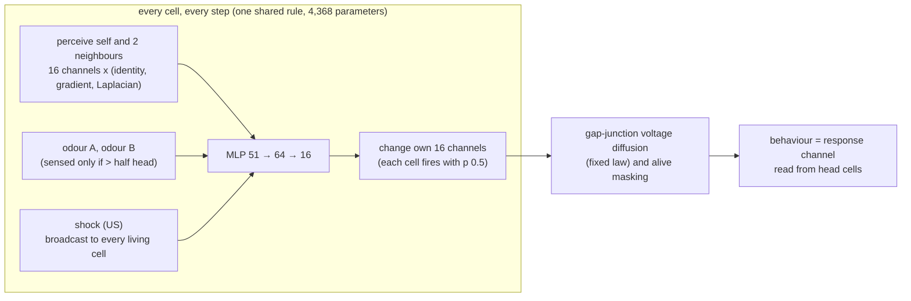

# Prometheus-α

**Does a regenerating body remember what its lost head learned? Synthetic worms grow from one cell, learn which odour predicts a shock, lose their heads, regrow them, and are asked again.**

Author/project lead: **Kai Piper** · Version **0.1.0** · 29 September 2026

> **Scientific status.** Everything here is a synthetic computational experiment on a neural cellular automaton. "Memory", "head", "odour" and "shock" name parts of a simulation. Nothing here is a model of a particular animal, and nothing here bears on any person or clinical condition.

Every day an eagle ate Prometheus's liver and every night it grew back. The name means *forethought*. This laboratory asks a question about regrowth and foresight that biology has raised and never answered: when an animal regrows the organ that learned something, does the new organ know it?

Planarian flatworms trained to find food in a textured, lit dish still show the habit after their heads are cut off and regrown ([Shomrat & Levin 2013](https://doi.org/10.1242/jeb.087809)); an August 2026 preprint reports the same with light-to-food conditioning ([bioRxiv 2026.08.10.741213](https://www.biorxiv.org/content/10.64898/2026.08.10.741213v1)). Moths remember what they learned as caterpillars through the dissolution of metamorphosis ([Blackiston, Silva Casey & Weiss 2008](https://doi.org/10.1371/journal.pone.0001736)). Where the memory waits while the brain is gone, and how the new brain reads it back, is unknown. McConnell's memory-transfer experiments of the 1960s asked the same question and could not be replicated.

Prometheus-α asks it of a synthetic body in which every cell's state can be read, copied, swapped and transplanted:

1. **A body that learns without changing its rule.** One small network, shared by every cell, is trained by backpropagation through whole lives. Within a life the rule is frozen, so a worm can only learn by changing its cells' *state*. That makes "where is the memory?" a question about places in the body.
2. **Only the head can smell.** A cell senses the odours only when it is more than half head tissue. Behaviour is read from the head. After complete decapitation no surviving cell can smell or behave.
3. **Pavlovian conditioning with the proper control.** One odour is paired with a shock. Every paired worm has an *explicitly unpaired twin*: the same odours, the same number of shocks at the same moments of its life, the same random update noise, the same founder; only the contingency differs. The memory measure is taken within the worm, so baseline shifts cancel.
4. **Emergent versus selected.** *E* rules are trained to learn and to regenerate, but never asked to remember through a regeneration. *S* rules are selected from their E sibling by also asking for memory after one amputation. Chimeras, voltage transplants, trunk fragments and repeated amputation are never trained in either.

<!-- findings:start -->
<!-- findings:end -->

Every number in the results table is checked in CI against the results file it comes from (`prometheus claims check`). The hypotheses, sample sizes, seeds and decision rules were hash-locked in [`prereg/PREREGISTRATION.json`](prereg/PREREGISTRATION.json) before any confirmatory experiment; pilots and pre-lock design changes are disclosed there and in [`docs/DEVIATIONS.md`](docs/DEVIATIONS.md).

## Built from eight earlier projects

| Earlier project | What Prometheus-α takes from it |
|---|---|
| [Morpheus](https://github.com/kai9987kai/morpheus) | the regenerating neural cellular automaton with a fixed gap-junction voltage law; "does a rewritten state survive re-amputation?" (Morpheus's compiled heads did not); the claims-ledger checker, statistics and JS/Python parity testing. Morpheus asked whether a *body plan* is remembered; this asks whether a *learned association* is |
| [Ghost in the Machine](https://github.com/kai9987kai/GhostInTheMachine) | the yoked-twin design (master vs a twin with matched input statistics), transplanting a signal between individuals to test where an effect lives, preregistration with a hash lock, A/A calibration, and a smallest effect of interest so a precise but trivial effect cannot pass |
| [GenesisEngine](https://github.com/kai9987kai/GenesisEngine) | development from a single founder cell; a deterministic seeded core separate from the renderer; paired seeds per intervention |
| [Supermix Expanse](https://github.com/kai9987kai/Supermix-expanse) / [v2](https://github.com/kai9987kai/Supermix-Expanse-v2) | the "evoked" lesson: the CNS core's gain was mostly a constant bias, so the readout here is a within-worm difference (CS+ minus CS-) that a bias cannot fake; zero-initialised action heads; hash-locked hypotheses with verdicts computed from recorded metrics |
| [Supermix Archimedes](https://github.com/kai9987kai/supermix-archimedes) | grafting between independently trained systems, made literal: chimeras are grafts of one worm's head onto another's body, and the question is which system's knowledge wins |
| [Supermix](https://github.com/kai9987kai/Supermix) | "the ruler moved": test generators, caps and cohorts are fixed and seeded, and every results file records the weights' and the preregistration's SHA-256 and the git commit |
| [FLY-DIAMOND-NEXUS](https://github.com/kai9987kai/FLY-DIAMOND-NEXUS) | a broadcast unconditioned signal to every cell, like dopamine to the mushroom body; paired-seed arms with bootstrap intervals; exact, seed-reproducible replay in the browser |

## What is new here

To my knowledge none of these has been done before:

* **A computational Shomrat–Levin experiment.** A learned association formed only by head tissue, followed by complete decapitation and regeneration, in a body whose every cell state is observable.
* **Emergent versus selected memory persistence.** The same rule, before and after selection for remembering through one regeneration, tested on held-out manipulations it never saw.
* **Memory chimeras.** The head of a worm that learned A grafted onto the body of a worm that learned B: whose memory does the animal express, and whose comes back after the chimera's head is cut off?
* **Memory transplant by voltage.** Copying one body's voltage pattern, and nothing else, into another decapitated body, and asking the regrown head.
* **Promethean cycles.** Repeated decapitation of the same worm, far beyond anything trained.

## How it works



**The worm.** 40 sites; the body occupies 32 of them (head 8, trunk 16, tail 8). Each cell has 16 channels: alive-ness, membrane voltage, three region identities, a response channel and 10 hidden channels with no target. A worm grows for 32 steps from one founder cell.

**A life in an experiment.** Grow 32 steps; conditioning, 48 steps (six 8-step slots in random order: two with the CS+, two with the CS-, two empty; the paired worm is shocked in the last 3 steps of each CS+, its unpaired twin in the middle of each empty slot); wait 12 steps; then the experiment's manipulation (decapitation, a graft, a voltage transplant); regenerate 32 steps; test each odour alone for 6 steps. The memory measure is `M = [R(CS+) - R(CS-)] of the worm - the same of its unpaired twin`.

**Training.** Exact backpropagation through lives of about 180 steps (PyTorch, CPU), batches of 32 random lives (paired, unpaired or naive; with or without a first wound; with or without a wound after conditioning). The loss scores anatomy at four checkpoints, the unconditioned response to the shock, a silent baseline, and the memory test. E rules score memory only when the body was not wounded after conditioning; S rules also score it after a head or tail cut.

## Results

<!-- claims:start (generated by `prometheus claims render`; edit claims/claims.json) -->

| claim | status | evidence |
|---|---|---|

<!-- claims:end -->

## Quick start

```bash
python -m pip install torch --index-url https://download.pytorch.org/whl/cpu
python -m pip install -e ".[test]"
prometheus show --weights weights/rule_S0.json --cycles 2    # ASCII: grow, learn, lose the head, regrow, ask
python -m pytest -q                                           # engine invariants, JS/Python parity, statistics
prometheus prereg verify                                      # the preregistration lock still holds
prometheus claims check                                       # every quoted number against the results files
```

Open **`web/index.html`** in a browser for the interactive lab: condition a worm, cut its head off, regrow it, graft on a head from a worm that learned the other odour, block gap junctions, and run Promethean cycles, with a live kymograph of every channel. It needs no server or build step. `prometheus export-web` refreshes `web/data.js`.

Reproduce everything (about 90 minutes on a 4-core laptop CPU, one thread per run):

```bash
prometheus train --family E --seed 0 --iterations 3000 --out weights/rule_E0.json
prometheus train --family E --seed 1 --iterations 3000 --out weights/rule_E1.json
python -c "from prometheus import train; [train.save(train.train(train.Config(family='S', seed=s, iterations=2000, threads=1, init=f'weights/rule_E{s}.json')), f'weights/rule_S{s}.json') for s in (0, 1)]"
for r in E0 E1 S0 S1; do prometheus run --weights weights/rule_$r.json --out results/rule_$r.json; done
prometheus claims render && prometheus export-web
```

Runs are deterministic for a given PyTorch version: every founder, schedule and update mask comes from a recorded seed.

## Repository map

| Path | What |
|---|---|
| `src/prometheus/tissue.py` | the cell rule, perception, sensory gate, gap-junction physics, behaviour readout |
| `src/prometheus/body.py` | the target body plan, wounds, anatomy scores |
| `src/prometheus/life.py` | timelines: conditioning (paired, unpaired, naive), tests, wounds, the runner |
| `src/prometheus/train.py` | backpropagation through whole lives; the E and S objectives |
| `src/prometheus/experiments.py` | H1-H7, calibration, anatomy, the channel-locus and gap-junction explorations |
| `src/prometheus/stats.py` | paired bootstrap, sign-flip tests, Holm |
| `src/prometheus/claims.py`, `prereg.py` | the claims ledger and the preregistration lock |
| `prereg/` | hypotheses, seeds and decision rules, and their SHA-256 lock |
| `results/` | every results file the README quotes, with provenance; `results/pilot/` holds the disclosed pilots |
| `weights/` | the four confirmatory rules (`weights/pilot/` the pilot rules) |
| `web/` | the browser lab (`index.html`) and the JavaScript engine (`engine.js`), tested step for step against Python |

## Limitations

* Two rules per family. Whether a result holds for rules in general is tested only by its replication in the second rule.
* The body is one-dimensional and 32 cells long, the rule is small, and the "odours" and "shock" are two input lines and a broadcast scalar. The biology motivates the questions; it is not modelled.
* "Memory" here is operational: a within-worm difference in response to two cues, measured against an explicitly unpaired twin.
* S rules were selected to remember through one regeneration, with training cuts at the head/trunk boundary ±2 sites. Their survival of one decapitation is a positive control, not a discovery. What is held out is everything else: complete decapitation with a margin, fragments, chimeras, voltage transplants and repeated cycles.

## Research context

* Shomrat, T. & Levin, M. (2013). An automated training paradigm reveals long-term memory in planarians and its persistence through head regeneration. *J Exp Biol* 216:3799–3810.
* Trained planaria retain memories through head regeneration (bioRxiv, August 2026, 10.64898/2026.08.10.741213).
* Blackiston, D. J., Silva Casey, E. & Weiss, M. R. (2008). Retention of memory through metamorphosis. *PLoS ONE* 3:e1736.
* Mordvintsev, A. et al. (2020). Growing neural cellular automata. *Distill*.
* Pezzulo, G. & Levin, M. (2016). Top-down models in biology. *J R Soc Interface* 13:20160555; Durant, F. et al. (2017). Long-term, stochastic editing of regenerative anatomy via targeting endogenous bioelectric gradients. *Biophys J* 112:2231–2243.
* Guichard, E. et al. (2025). EngramNCA: a neural cellular automaton model of memory transfer. arXiv:2504.11855 (morphological "genes" in private channels; no learning within a life, no regeneration test).
* Pio-Lopez, L., Hartl, B. & Levin, M. (2026). BraiNCA: brain-inspired neural cellular automata. arXiv:2604.01932.
* Rescorla, R. A. (1967). Pavlovian conditioning and its proper control procedures. *Psychol Rev* 74:71–80. Rescorla's caveat about the explicitly unpaired control is that its CS can become a safety signal; here both odours are equally unpaired in the twin, so any such inhibition cancels inside the twin's own CS+ minus CS- difference.

## License

MIT, see [LICENSE](LICENSE).
