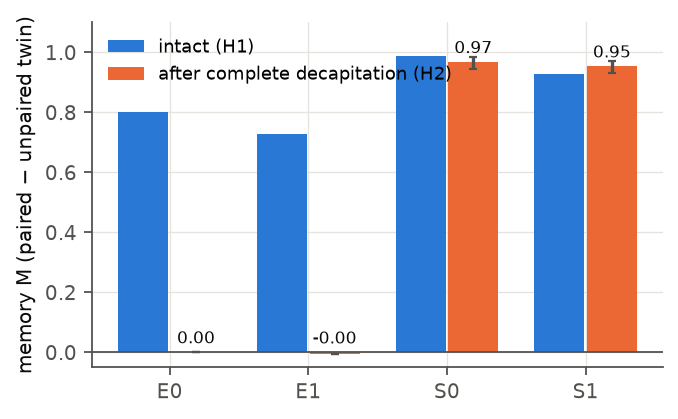
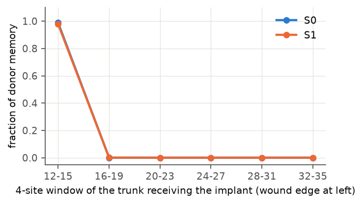
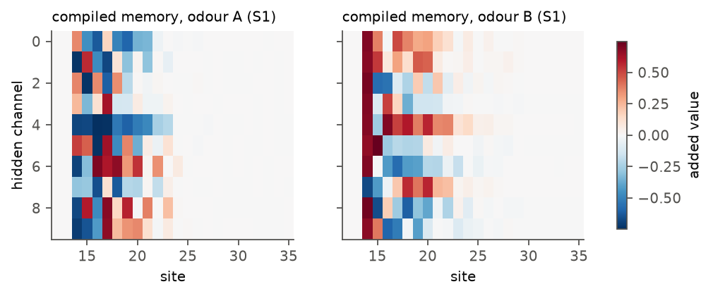
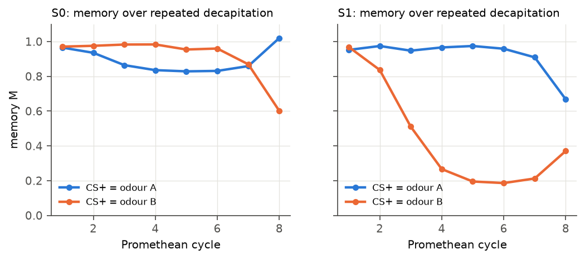

# Memory that outlives its organ: preregistered experiments on learning, decapitation and regeneration in synthetic worms

**Kai Piper** · Prometheus-α v0.3 · 29 September 2026 · code, data and preregistrations: [github.com/kai9987kai/prometheus-alpha](https://github.com/kai9987kai/prometheus-alpha)

> **Scientific status.** This is a synthetic computational study of a neural cellular automaton. "Worm", "head", "odour", "shock" and "memory" name parts of a simulation. It models no particular animal and makes no claim about any person or clinical condition.

## Abstract

Planarian flatworms trained before decapitation still show the training after their heads regrow, and nobody knows where the memory waits while the brain is gone. We built synthetic worms in which that question can be answered exactly. Each worm is a one-dimensional neural cellular automaton that grows from one founder cell; every cell runs the same small, learned rule, which is frozen within a life, so a worm can learn only by changing its cells' state. Only cells that are more than half head tissue can sense two odours, and behaviour is read from the head. Worms learn in differential Pavlovian conditioning, each measured against an explicitly unpaired twin with identical noise. Across three preregistered, hash-locked rounds (42 confirmatory hypotheses tests per round-rule, 128 worms per test) we find: (1) rules trained to learn and to regenerate, but never asked to remember through regeneration, regrow near-perfect heads that remember nothing (retention 0.1% and −0.7%); (2) the same rules, selected to remember through one amputation, keep the memory through complete decapitation (retention 98%, 102%), through removal of head and tail, and through repeated decapitation, none of which was trained; (3) the body's copy is held not in the bioelectric voltage channel, which is neither necessary nor sufficient, but in hidden cell state, and almost entirely (98–99%) in the four cells at the wound edge; (4) a gradient-designed pattern of that hidden state, written into an untrained headless body, makes the regrown head remember an odour the animal never experienced, even in rules whose bodies never keep a copy themselves; (5) after a reversal, the body is more conservative than the head and regrows the older lesson. Several pilot-based predictions failed, including the direction of reversal and the resolution of head–body memory conflicts, and are reported as failures. The failures led to a post-hoc finding, confirmed in one of two rules on fresh data, that selection makes one odour's memory an attractor and the other's metastable.

## 1 Introduction

Every day an eagle ate Prometheus's liver and every night it grew back. Regeneration raises a question about memory that is older than the myth's modern readings. Planarians trained to find food in a textured, lit arena still show the habit after decapitation and head regrowth (Shomrat & Levin 2013), and a 2026 preprint reports the same for light-to-food conditioning. Moths remember what they learned as caterpillars through metamorphosis (Blackiston et al. 2008). McConnell's memory-transfer experiments of the 1960s asked whether memory could live outside the brain and failed to replicate. The hypotheses on offer range from bioelectric pattern memory in the body (Levin 2021; Durant et al. 2017) to molecular engrams, and none can yet be tested cell by cell in an animal.

A synthetic body can be read and edited completely. We use one to ask five questions: (i) does a body that can rebuild a head keep a copy of what the head learned, without being asked to? (ii) if selected to, where is the copy, and in which state variables? (iii) can the copy be written, overwritten, transplanted? (iv) what happens to it under conflict, extinction, reversal and repeated loss? (v) is information that can be decoded from the body the same as information the body uses?

The study inherits its methods from a series of earlier projects: preregistration with a cryptographic lock and a claims ledger checked in continuous integration (Ghost in the Machine; Morpheus), yoked-twin controls (Ghost in the Machine), development from a single founder (GenesisEngine), a regenerating neural cellular automaton with fixed gap-junction physics (Morpheus), and the lesson that a learned module can act as a constant bias unless the readout is a within-subject contrast (Supermix Expanse).

## 2 Model

**Worm.** A grid of 40 sites; the target body occupies 32 (head 8, trunk 16, tail 8). Each cell has 16 channels: alpha (aliveness), membrane voltage, three region identities, a response channel and ten hidden channels with no target. A cell perceives its own state and its two neighbours' (identity, gradient, Laplacian of every channel: 48 values) plus three signals from the world: odour A and odour B, gated by `clamp(2·head − 1, 0, 1)` so that only cells more than half head can sense them, and the unconditioned stimulus (US, "shock"), broadcast to every living cell. A two-layer MLP (51 → 64 → 16, 4,368 parameters, zero-initialised output) proposes a change of all channels; each cell applies it with probability 0.5 per step. Voltage then diffuses through gap junctions between cells in the alive mask by a fixed law (conductance 0.25, two substeps) that the rule cannot change. Behaviour is the gated-head-weighted mean of the response channel, and is zero when no head tissue remains.

**Lives.** Grow 32 steps from one founder cell; condition 48 steps (six 8-step slots in random order: two CS+, two CS−, two empty; the paired worm is shocked on steps 3–5 of each CS+ slot, its unpaired twin on the same steps of each empty slot); wait 12 steps; manipulate; regenerate 32 steps; test each odour alone for 6 steps. The memory measure is `M = [R(CS+) − R(CS−)]_paired − [R(CS+) − R(CS−)]_unpaired twin` for a worm and a twin that share founder, schedule and every asynchronous update mask.

**Training.** Exact backpropagation through lives of 180–240 steps (PyTorch, CPU, batch 32, Adam), scoring anatomy at checkpoints, the unconditioned response, a silent baseline and the memory test. *E (emergent)* rules (seeds 0, 1; 3,000 iterations) score memory only when no wound followed conditioning. *S (selected)* rules start from their E sibling and train 2,000 further iterations scoring memory also after a head or tail cut. *B (balanced)* rules (v0.3) start from their S sibling and train 1,500 iterations on lives with two successive amputations.

**Decapitation** in experiments is complete: every site up to the worm's own last head-labelled cell, plus a two-site margin. The residual gated head weight after decapitation is exactly zero in every experiment: no surviving cell can sense an odour.

**Statistics.** Per-worm paired differences; sign-flip permutation tests (10,000 permutations); Holm–Bonferroni within each rule's family at α = 0.05; a hypothesis counts as supported only if Holm rejects *and* |mean| ≥ 0.10 response units (a trained conditioned response is ~1), so precise trivial effects cannot pass. Each round's hypotheses, seeds, sample sizes, decision rules and predictions were committed, SHA-256-locked together with every source file that can change a confirmatory number, and pushed before any confirmatory run. Pilots on separate pilot rules are disclosed in each preregistration. Every number quoted in the README is a JSON pointer into a results file, checked in CI.

## 3 Results

### 3.1 Without selection, the new head forgets (v0.1)

All four rules learn (H1; M = 0.80, 0.73, 0.99, 0.93; d_z 3.8–12.7) and regrow the body from the founder and after every wound (IoU ≥ 0.99 after head regeneration). E rules regrow near-perfect heads that carry none of the memory (H2; M = 0.001 [95% CI −0.000, 0.001] and −0.005 [−0.006, −0.004]; Fig. 2). Selected rules keep it (M = 0.97, 0.95; retention 0.98, 1.02). Held-out generalisation in S rules: memory after removal of head and tail (H7; 0.96, 0.96) and after a third successive decapitation (H6; 0.94, 0.73).

*Fig. 2. Memory M in intact worms and after complete decapitation and regrowth; 128 worms per bar, bootstrap 95% CI on the regrown bars.*

### 3.2 Where the copy lives (v0.1, v0.2)

Swapping a decapitated trained body's voltage for its untrained twin's keeps 98–99% of the memory (H3a) and implanting the voltage alone into the twin transfers 2–4% (H3b): voltage is neither necessary nor sufficient. The ten hidden channels alone transfer the memory almost completely (H3c; 1.00 and 0.98 of the donor's). Blocking gap junctions between learning and the cut has no effect. v0.2 localised the copy: implanting the hidden channels at only the four sites next to the wound transfers 99% (S0) and 98% (S1) of the memory; the rest of the trunk, 0.1% (H13; Fig. 3).

*Fig. 3. Engram map: the trained body's hidden channels implanted into its untrained twin's decapitated body, 4 sites at a time.*

### 3.3 Writing memories (v0.2)

We designed, by gradient descent through regeneration on 32 design worms, a 10 × 40 pattern added to the hidden channels of an untrained decapitated body so that the regrown head prefers a chosen odour (H12). On 128 held-out worms the written memory was +1.00 (S0) and +0.99 (S1), against +0.14 and −0.01 for the same values at shuffled sites: the spatial code matters, not the dose. The compiler also wrote memories into E rules (+0.50, +0.67), whose bodies never keep a copy themselves, though only one odour reliably in each (E0 writes B at −0.96 but A at +0.05). Fig. 5 shows the compiled patterns.

*Fig. 5. Compiled memories for S1: the values added to each hidden channel at each site. Most of the pattern sits at the wound edge.*

### 3.4 Conflict, extinction, reversal and repeated loss (v0.1, v0.2)

**Chimeras.** Grafting the head of a worm trained on one odour onto the body of a worm trained on the other: in E rules the head's memory wins outright (dominance 0.99, 1.01); in S rules the head leads (0.84, 0.53), contrary to the pilot-based prediction of an even split. After the chimera is decapitated and regrows, the pilot predicted the body's memory would return; this held weakly in S1 (−0.12) and reversed in S0 (+0.36).

**An attractor.** Reading the grafts post hoc showed that in each S rule conflicts resolved toward one odour whichever tissue carried it, transfer to a naive head passed that odour on and hardly the other, and over repeated decapitation that memory held while the other eroded. v0.2 tested this on fresh worms with the direction named in advance (H8): supported in S1 (favoured 0.96 vs other 0.34 at cycle 4; Fig. 4) and below the effect-size threshold in S0 (+0.09). Over eight cycles S0's pattern is not an attractor at all: its "favoured" odour collapses at cycle 8 (0.60).

*Fig. 4. Memory for each CS+ over eight successive decapitations (64 worms per rule; exploratory).*

**Extinction.** Unreinforced presentations weakened the memory of S1 (−45%) but not of S0 or of the E rules (H9). Neither rule was ever trained on extinction. The pilot's striking inversion, a regrown head more extinguished than the intact one, did not replicate: after extinction the body's copy followed the head's state (H10 means −0.02).

**Reversal.** After learning one odour and then the other, intact S heads half-adopted the new lesson (first-lesson memory 0.52, 0.34). Regrown heads reverted toward the first (0.82, 0.63; H11 +0.30, +0.29). The pilot had predicted the opposite. The body is more conservative than the head.

### 3.5 v0.3

<!-- v3 -->

## 4 Discussion

**Regeneration does not imply remembering.** Rules that regrow flawless heads keep nothing of what the old head learned unless selected to; a body's capacity to rebuild an organ and its capacity to rebuild what the organ knew are separable.

**The engram at the wound.** Selected rules place the body's copy in the few cells that will seed the new head. This is where a copy is most useful and least costly: the regrowing head is built from the wound edge outward. Whether real regenerating animals concentrate memory-relevant state in their blastema is, as far as we know, untested and testable.

**Not electrical, here.** Voltage in this model is passive diffusion under a fixed law and the hidden channels are free, so training had an easy non-electrical route. The result shows that a regenerating body *can* keep the copy outside its voltage, not that bodies do; a model with active, bistable ion-channel dynamics could give the other answer.

**Decodable is not used.** In E rules the odour can be decoded from the wound-edge cells (§3.5) although the regrown head never uses it. Reading information from a tissue is not evidence that the tissue stores the memory for the animal; causal transplants are.

**Failures.** Of our pilot-based predictions, those about extinction inversion, reversal direction and head–body conflict failed on fresh rules. The pilots were one rule each; the confirmatory rules were two new ones. The attractor finding was itself born from a failure and replicated in one of two rules. We report these as failures rather than re-describing them.

**Limitations.** Two rules per family; a one-dimensional 32-cell body; odours and shock are input lines; training cuts in S rules sometimes spared head cells; the favoured-odour attractor has no mechanism yet.

## 5 Reproducibility

`prometheus train` / `run` / `run2`, `python -m prometheus.v3`, `python tools/figures.py`, `python tools/build_claims.py && prometheus claims check`. Three preregistrations and locks in `prereg/`, verified in CI; every deviation in `docs/DEVIATIONS.md`, including an exploratory crash in v0.2 whose rerun reproduced every confirmatory number exactly. The browser lab (`web/index.html`) runs a JavaScript engine tested step for step against Python (maximum state error 2 × 10⁻⁶ on trained rules).

## References

Blackiston, D. J., Silva Casey, E. & Weiss, M. R. (2008). Retention of memory through metamorphosis. *PLoS ONE* 3:e1736.
Durant, F. et al. (2017). Long-term, stochastic editing of regenerative anatomy via targeting endogenous bioelectric gradients. *Biophys J* 112:2231–2243.
Guichard, E. et al. (2025). EngramNCA: a neural cellular automaton model of memory transfer. arXiv:2504.11855.
Levin, M. (2021). Bioelectric signaling: reprogrammable circuits underlying embryogenesis, regeneration, and cancer. *Cell* 184:1971–1989.
McGrath, T. et al. (2023). The Hydra effect: emergent self-repair in language model computations. arXiv:2307.15771.
Mordvintsev, A., Randazzo, E., Niklasson, E. & Levin, M. (2020). Growing neural cellular automata. *Distill*.
Pio-Lopez, L., Hartl, B. & Levin, M. (2026). BraiNCA: brain-inspired neural cellular automata. arXiv:2604.01932.
Rescorla, R. A. (1967). Pavlovian conditioning and its proper control procedures. *Psychol Rev* 74:71–80.
Shomrat, T. & Levin, M. (2013). An automated training paradigm reveals long-term memory in planarians and its persistence through head regeneration. *J Exp Biol* 216:3799–3810.
Trained planaria retain memories through head regeneration (bioRxiv, 2026). doi:10.64898/2026.08.10.741213.
